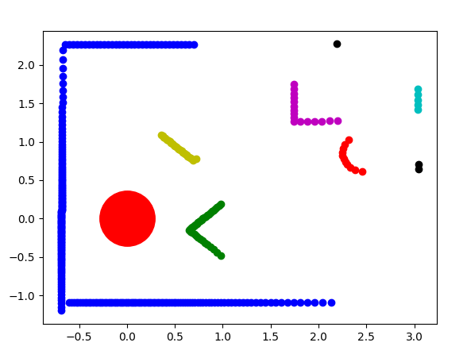
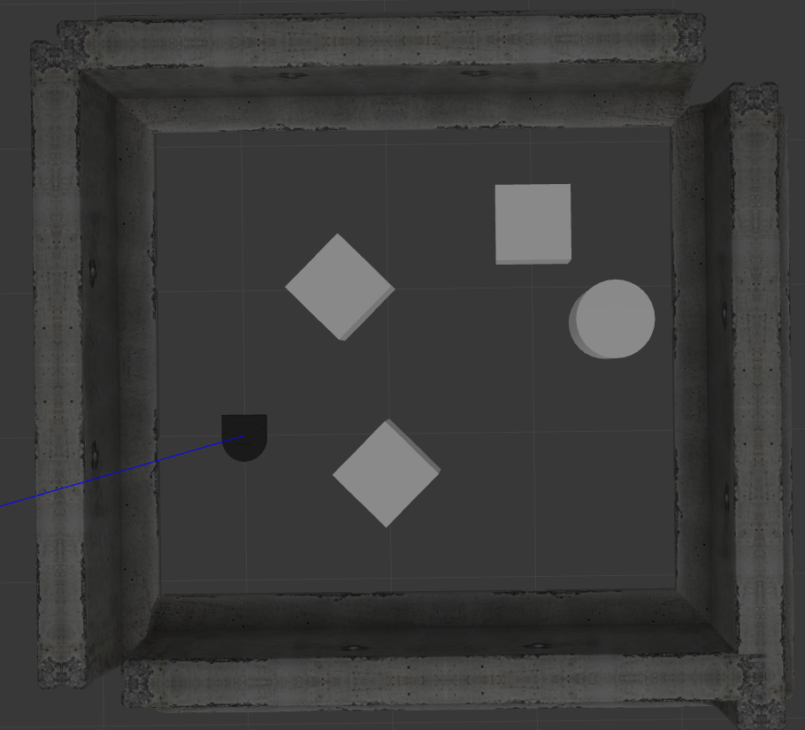
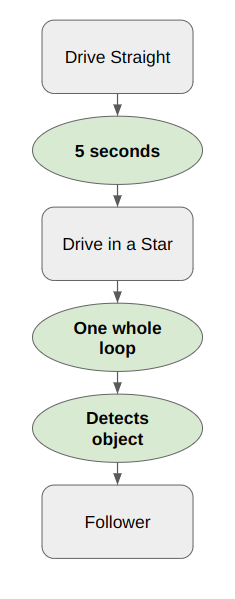
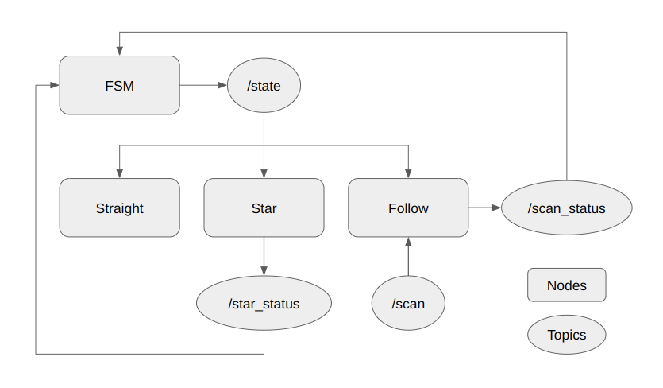

# RoboBehaviors and Finite State Machines Project

By Bill Le and Oscar Bao  
Fall 2025

# Overview

This warmup project introduced us to the ROS2 architecture and provided us with experience programming with the Neato robots through implementation of three different behaviors (with a range of difficulty: fundamental, basic, and advanced) and the finite-state-machine. The three behaviors are drive straight, drive in a star, and person/object following.

Our approach was implementing simpler behaviors, then refining them to enable more complex behaviors. We started with a simple drive forward task that required a `Twist` publisher to `/cmd_vel`, commanding the robot to move forward at a constant velocity. Building onto this, we developed the drive in a star task which used a similar publisher. However, the robot needs to be aware of the time it has traveled for to turn in the shape of a star. Lastly, we incorporated LiDAR-based sensing to detect objects and follow them.

The transition between the behaviors are determined by the finite-state-machine. The routine is as follows. Firstly, the robot will drive straight for five seconds. Then, it’ll start driving in the shape of a star. Once it has completed one full star, the robot starts looking for objects within 1.5m of itself. If it finds something, it will start following that object indefinitely.

By the end of the project, we gained practical experience with ROS2’s publisher–subscriber architecture and also developed a workflow for debugging, modular design, and integration. This structure allowed us to move from basic control to higher-level logic, culminating in a finite-state system determining how the robot would switch between different behaviors.

[Link to the demo video.](https://olincollege-my.sharepoint.com/:v:/g/personal/xbao_olin_edu/EQ9RwmKvkPJPsPmbYa1oZWEBxrado_q5ZWwD28ePKFQJgg)

# Behaviors

Each behavior is executed by individual nodes. These nodes subscribe to a topic named `/state`. The topic broadcasts the current desired behaviors of the robot and is published by the finite state machine which we will further explain in section *Finite State Machine.*

## 1\. Driving Straight (fundamental)

The driving straight node commands the robot to drive forward at a constant velocity of 0.2 m/s. The velocity is controlled by publishing `Twist`s to the topic `/cmd_vel`. `Twist`s are objects which take in a linear vector and angular vector. The `x` component of the linear vector controls the forward linear velocity of the robot. The `z` component of the angular vector controls the angular velocity of the robot. Hence, for this node, we only need to use the linear vector, specifically the `x` component (being 0.2 in this case).

Each node has a variable (`boolean`) tracking whether it is active, determined by the finite state machine. When the node is active (`boolean` is `true`), the node publishes a `Twist` commanding the robot to drive forward at a constant velocity. When the node is inactive (`boolean `is `false`), the node does not publish any message.

## 2\. Driving in a star (basic)

The driving star node follows the structure of the `draw_square` node we wrote in class. We chose to use a timer instead of threads for easier transition between different states—it’s hard to restart a thread once it finishes. The architecture of the node is simple: a subscriber that listens to `/state`, and a publisher that is ready to publish to `/cmd_vel` when we are in the `star` state. 

The actual driving part of the node is divided into driving in a straight line and turning. The node alternates between the two states, with a counter counting how many turns it has made. Once the node has made five turns, i.e. finished drawing a full star, it publishes `True` to `/star_status`, indicating to the FSM node that it is ready to move on.

## 3\. Person/Object Following (advanced, not explained in class)

The follower node commands the robot to follow a detected object within 1.5 meters. Our approach is broken down into four steps: parsing LiDAR scan data, object detection (clustering), object selection, and proportional error control.

The LiDAR scan data consists of distance readings at each whole number angle (in degrees), which is powerful but does not integrate well with coordinate frames. Therefore, we parse the data by applying the two following formulas where $\theta$ represents angle and $d$ represents distance (in meters).

**NOTE:** when $\theta$ is zero, the LiDAR scan is reading the front of the robot, with increasing $\theta$ corresponding to readings in the counter-clockwise direction.

```math
\begin{align*}
x &= -sin(\theta)\times d \\
y &= -sin(\theta)\times d
\end{align*}
```

To further parse the data, we replace all values larger than 10 with 10. Larger values messed with the segmentation algorithm used in the next step (and we assumed that readings larger than the cutoff were inconsequential). The last step of parsing is removing all `NaN` values.

To detect objects, we use the DBSCAN clustering algorithm which finds clusters of points that are near each other. We did not implement the algorithm but used a function provided by the library `scikit-learn` instead. The library’s implementation allowed us to customize two variables: `eps` (maximum distance between points) and `min_samples`. The chosen values can be inspected in the `neato_follower.py` file.

<p align="center">


</p>

From the list of objects clustered by the DBSCAN algorithm, we need to select the object closest to the Neato. To do this, we used an image processing technique called image moments which gives us a coordinate informing us where the object is located. The formula is shown below.

```math
\begin{align*}
\bar{x} &= \frac{\sum{x_i}}{count} \\
\bar{y} &= \frac{\sum{y_i}}{count}
\end{align*}
```

We find the euclidean distance between each object’s moment and the origin (where the Neato is). If the distance is larger than 1.5, we discard it. From the valid objects, we select the object closest to the Neato.

The final step is commanding the Neato to follow the selected object and leave a distance of 0.5m between the Neato and the object. Similar to previous steps, we send `Twist` messages to topic `/cmd_vel`. Proportional control determines the speed sent to the topic. This is to combat overshooting and ensure a smooth motion. However, using only proportional control causes the robot to overshoot back and forth as it almost reaches the desired destination. Therefore, we implemented a cutoff where the velocities are set to zero when the error goes below a certain value. The proportional control is also useful because it removes the need to calculate exactly how long the Neato needs to move. But this does require the error calculation to be done continually and consistently which might not be possible in other systems. Furthermore, in future works, we can implement a full PID controller to remove the overshoot problem. However, we also realize that for the current application, a PID controller is over-optimized for the problem.

# Code Structure

The core structure revolves around behavior classes and a finite state machine class that ties behaviors together. The separation of responsibilities and abstraction made it easier to develop, test, and maintain each behavior independently.

Here are the main components and how they relate:

* **Behavior Classes:** Each major robot behavior is encapsulated in its own class. Each class is responsible for subscribing to relevant sensors (such as LiDAR scans), doing processing (segmentation, timing, etc.), computing control commands (velocity, angular corrections), and publishing movement commands. This makes it easier to make changes and test behaviors later.

* **Finite State Machine (FSM)**: This is a higher‐level controller class that orchestrates when behaviors are active. The FSM monitors topics it subscribes to from behavior classes (`/star_status` and `/scan_status`) and switches between behavior classes based on those states. This class communicates with the behavior classes by publishing to a topic called `/state`.

* **External ROS2 topics from Neato**: Within each behavior, the code interacts with the Neato by publishing and subscribing to certain topics. The `/cmd_vel` topic is responsible for controlling the robot's movement. The behaviors must send messages to this topic and its explanation can be found in section [Behavior (driving straight)](#1-driving-straight-fundamental). The `/scan` topic is responsible for providing the LiDAR scans. The robot can access this by subscribing to the topic. There are other topics to access other information about the Neato (such as camera, encoders, bumpers, etc.) but they were not required for this project.

Because of this organization, adding a new behavior is relatively straightforward: define the behavior class with its processing and velocity controls, then connect it with the FSM so that the system can switch into it under the right conditions. The object‐oriented and modular node structure keeps the codebase clean, avoids tangled interdependencies, and supports modular testing and debugging.

# Transitions

<p align="center">

</p>


1. Transition Requirement: Wait 5 seconds, Sensor: Timer, From drive straight to drive in a star  
2. Transition Requirement: One whole loop, Sensor: Timer, from drive in a star to follower if transition requirement three is satisfied.  
3. Transition Requirement: LiDAR detects objects within 1.5m, Sensor: LiDAR, from drive in a star to follower if transition requirement two is satisfied

# Finite State Machine

<p align="center">

</p>

The finite state machine (FSM) aims to implement the model shown in the section [Transitions](#transitions). Even though the transition model is straightforward and simple, implementing it into ROS2 requires us to intentionally make decisions about topics that relay information between the behavior node that will execute the act and the FSM which makes sure the behaviors operate in the correct order.

Taking a closer look at the nodes, we see that there is an FSM node and the three behavior nodes discussed in previous sections. The FSM node publishes a topic named `/state` which will be either `straight`, `star`, or `follow`. When a behavior receives the state, if the state matches their node, it will set itself as active. If not, it will set itself as inactive.

The drive straight for five seconds transition is accounted for by the FSM. However, for transition requirement two and three, we delegated the task of keeping track of transition requirements to themselves. The topic `/star_status` will send `True` when a loop of the star has been completed. The topic `/scan_status` will send `True` when an object is detected. Only when both topics have been sent `True` will the robot transition to the following behavior.

The follower node also subscribes to a `/scan` topic which is not a part of the package architecture. Instead, this node belongs to an external package and our code has no control over what kind of messages are published on that node. However, we are able to retrieve information from it and make decisions for the follower node.

# Conclusion

## Take-aways

One of the biggest takeaways from this project was that breaking complex tasks into smaller steps made everything much more approachable. By starting simple and building up, we were able to understand how each piece fit into the larger system. Writing features as individual nodes also allowed us to test each behavior individually. With practice, we became much more comfortable with ROS2’s publisher–subscriber model after writing multiple nodes and seeing them interact. We also used `RQT` and other commands such as `echo` to help bolster our understanding. The last key insight was how useful external libraries can be. In our case, we used `scikit-learn` for clustering which sped up development and showed us how ROS2 can integrate with outside tools.

## Challenges

There were also several challenges along the way. Parsing LiDAR data was more difficult than expected, especially when dealing with `NaN`s and very large distance values that broke our clustering. Getting the follower to behave smoothly was tricky since proportional control alone often caused overshooting and jittery motion. On top of that, tuning the clustering parameters was sensitive, small adjustments either gave us too many false objects or none at all. Managing state transitions in the finite-state machine was another hurdle, since it was easy for nodes to interfere with each other if not carefully controlled.

## Next Steps

Looking ahead, there are a few clear improvements we would make. The low-hanging fruit would be to replace proportional control with a full PID controller to reduce overshoot and make following smoother. We would also like to improve object detection so the robot can distinguish between people or other objects. Beyond that, we see opportunities to expand with more advanced behaviors such as obstacle avoidance, wall following, or path planning, which could be integrated into the same finite state machine framework.
